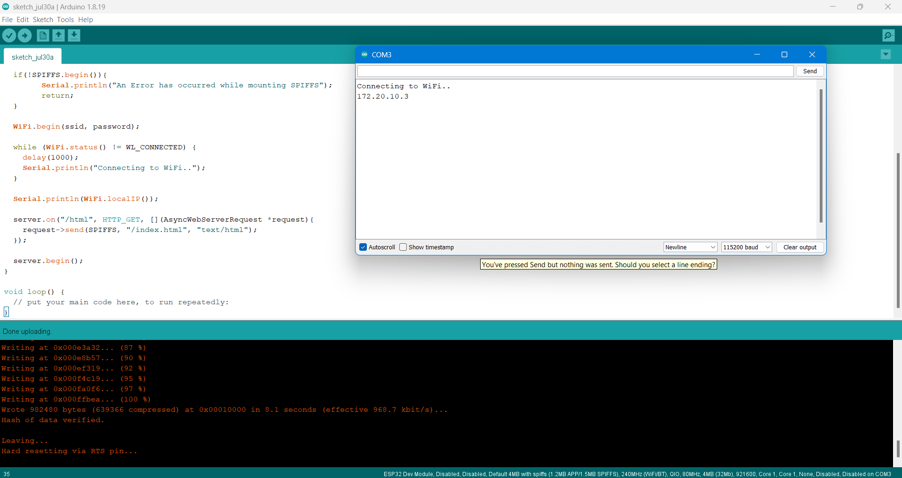
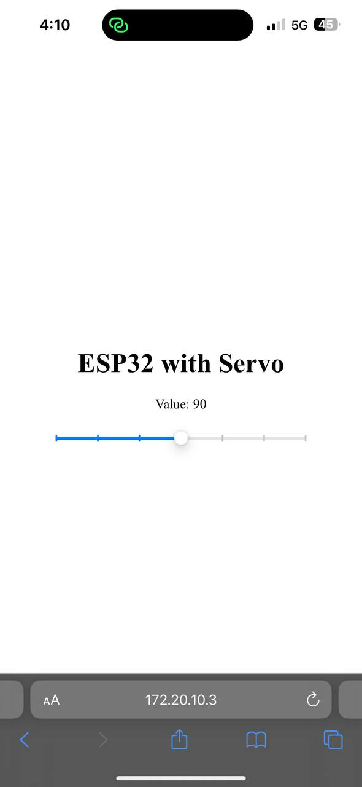

# 5th-Task-web

## 1- Upload the HTML code into ESP32 web server
[Link To Source File](sketch_jul30a.ino)
- First, I created a basic HTML file with a slider to control the angle of the servo.
- Second, I downloaded the ESPAsyncWebServer and AsyncTCP libraries as ZIP files and added them to Arduino via Sketch > Include Library > Add .ZIP Library.
- Third, I installed the ESP32 Sketch Data Upload Tool and extracted it into the tools folder.
- Fourth, I created a `data` folder in my project directory and placed the HTML file inside it.
- Finally, I began coding...
  - Include libraries
    ```
    #include <WiFi.h>
    #include <AsyncTCP.h>
    #include <ESPAsyncWebServer.h>
    #include <SPIFFS.h>
    ```
  - Define network and create a web server
    ```
    const char* ssid = "";
    const char* password = "";
     
    AsyncWebServer server(80);
    ```
  - Connect the ESP32 to Wi-Fi
    ```
    WiFi.begin(ssid, password);
    ```
  - Set up an HTTP request
    ```
    server.on("/html", HTTP_GET, [](AsyncWebServerRequest *request){
       request->send(SPIFFS, "/index.html", "text/html");
    });
    ```
  - Start the server
    ```
    server.begin();
    ```
    
  
  


  ## 2- Send the angle value to the ESP32 directly 
    
    
