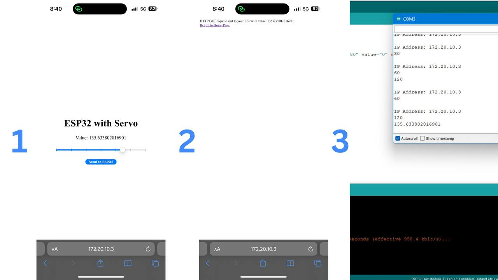

# 5th-Task-web

## 1- Upload the HTML code into ESP32 web server
[Link To Source File](sketch_jul30a.ino)
- First, I created a basic HTML file with a slider to control the angle of the servo.
- Second, I downloaded the ESPAsyncWebServer and AsyncTCP libraries as ZIP files and added them to Arduino via Sketch > Include Library > Add .ZIP Library.
- Third, I installed the ESP32 Sketch Data Upload Tool and extracted it into the tools folder.
- Fourth, I created a `data` folder in my project directory and placed the HTML file inside it.
- Finally, I began coding...
  - Include libraries
    ```
    #include <WiFi.h>
    #include <AsyncTCP.h>
    #include <ESPAsyncWebServer.h>
    #include <SPIFFS.h>
    ```
  - Define network and create a web server
    ```
    const char* ssid = "";
    const char* password = "";
     
    AsyncWebServer server(80);
    ```
  - Connect the ESP32 to Wi-Fi
    ```
    WiFi.begin(ssid, password);
    ```
  - Set up an HTTP request
    ```
    server.on("/html", HTTP_GET, [](AsyncWebServerRequest *request){
       request->send(SPIFFS, "/index.html", "text/html");
    });
    ```
  - Start the server
    ```
    server.begin();
    ```
    
  
  


## 2- Send the angle value to the ESP32 directly 
  [Link To Source File](sketch_jul31a.ino)

- Define a constant character
    ```
    const char* PARAM_INPUT_1 = "angle";
    ```
    pointer to 
    ```
    <input id="pi_input" type="range" min="0" max="180" value="0" step="any" list="values" name="angle"/>
    ```
- Using the const char index_html[] PROGMEM to store HTML content
  ```
    const char index_html[] PROGMEM = R"rawliteral(
          <html>---</html>
    )rawliteral";
  ```
- In setup(), send web page to client
  ```
    server.on("/", HTTP_GET, [](AsyncWebServerRequest *request){
      request->send_P(200, "text/html", index_html);
    });
  ```
- Send a GET request and GET angle value
  ```
    server.on("/get", HTTP_GET, [] (AsyncWebServerRequest *request) {
      String inputMessage;
    // GET angle value on <ESP_IP>/get?angle=<inputMessage>
      if (request->hasParam(PARAM_INPUT_1)) {
        inputMessage = request->getParam(PARAM_INPUT_1)->value();
      }
      else {
        inputMessage = "No message sent";
      }
      Serial.println(inputMessage);
      request->send(200, "text/html", "HTTP GET request sent to your ESP with value: "+ inputMessage +
                                       "<br><a href=\"/\">Return to Home Page</a>");
  });
  ```
- Finally, Start the server
  ```
     server.begin();
  ```
  
  
